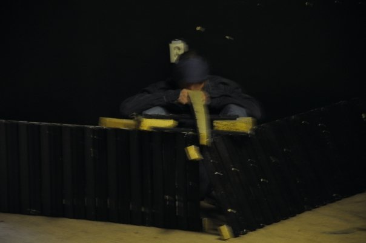
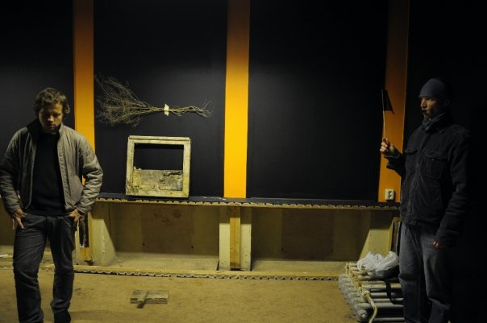

# erkki luuk

**transdistsiplinaarne kunstnik (tekst, installatsioon, etendus, maal, heli, video)**

**—————————————————————————————————**

## Isikunäitused (koos c:ga — Tanel Rander)

*————————*

### &nbsp; &nbsp; [uriaadi lõpp](http://chnldr.blogspot.com/2010/12/erkki-luuk-c-uriaadi-lopp-keldres-v.html). Y-galerii 2010

&nbsp; &nbsp; ***[kohaspetsiifiline](kaabus1.jpg) installatiivne keskkond***  

*————————*

### &nbsp; &nbsp; [kesktalvine hnott](http://chnldr.blogspot.com/2010/12/c-erkki-luuk-kesktalvine-hnott-on.html). [Tallinna](m2rrad-0.jpg) [Linnagalerii](m2rrad-2.jpg) 2010

&nbsp; &nbsp; ***installatsioon***

————————

### &nbsp; &nbsp; [Tammeöö](https://www.emys.ee/blog/tartu-pg). Pärmivabrik 2009, Tartu

&nbsp; &nbsp; ***installatsioon, etendus***

**—————————————————————————————————**

## Grupinäitused

————————

### &nbsp; &nbsp; Unistuste linn. Tartu tekstikunst 2002–2015. Tartu Kunstimuuseum 2015

&nbsp; &nbsp; ***installatsioon vitriinis***  
&nbsp; &nbsp; — x-kujuline tolm karbis  
&nbsp; &nbsp; — trükitud tekst "stephane mallarme, 188" (garamond, tähesuurus 11‒13) vana välimusega etiketil

&nbsp; &nbsp; [kunst.ee](http://ajakirikunst.ee/?c=kunstee-numbrid&l=et&id=1367)
<!-- [Grigor ‒ Miski pole.. (kunst.ee)](http://ajakirikunst.ee/?c=kunstee-numbrid&l=et&id=1367)  
http://www.indrekgrigor.com/wp-content/uploads/2017/02/Miksi_pole_olulisem_kui_see_lause.pdf -->

————————

### &nbsp; &nbsp; Prada Pravda. Y-galerii, festival Art Ist Kuku Nu Ut 2013

&nbsp; &nbsp; ***kaheosaline installatsioon "perekond kammib konna"***  
&nbsp; &nbsp; — "kohtumine artikli "mood ja teooria" [autoriga](luuk_vid.jpg)" ([video](spec1.mp4))  
&nbsp; &nbsp; — "volditud särk". volditud särk (raamituna ja klaasituna seinal)

&nbsp; &nbsp; [Areen](https://ekspress.delfi.ee/artikkel/66756385/prada-polvkonna-pravdatamine-tartus) &nbsp; &nbsp; [TPM](https://tartu.postimees.ee/2086952/kaasaegne-kunst-aimab-ette-soda) &nbsp; &nbsp; [Sirp](https://www.sirp.ee/2013-09-23-11-06-55)

————————

### &nbsp; &nbsp; [Eesti kunstiskeenede arheoloogia](https://kumu.ekm.ee/syndmus/eesti-kunstiskeenede-arheoloogia-ja-tulevik). Kumu 2012

&nbsp; &nbsp; [Areen](https://ekspress.delfi.ee/artikkel/65275150/parnakas-tartlane-ja-tallinlane-kunstisaalis)

————————

### &nbsp; &nbsp; [Muutuv maalikunst](https://kumu.ekm.ee/syndmus/muutuv-maalikunst). Kumu 2010

&nbsp; &nbsp; ***maalid***

&nbsp; &nbsp; [Sirp](https://sirp.ee/s1-artiklid/c6-kunst/muutuv-maalikunst-on-valinud-protsessuaalsuse) &nbsp; &nbsp; [Tamm](https://www.tammtamm.net/text/estonian/2010/fiktiivne-maalikunst/Maalikunst.pdf)

————————

### &nbsp; &nbsp; [Tartu](https://tartutrash.blogspot.com/2009/06/erkki-luuk.html) [Trash](https://tartutrash.blogspot.com/2009/06/erkki-luuk_02.html). Ferrodrum 2009, Tartu

&nbsp; &nbsp; ***maalid***

————————

### &nbsp; &nbsp; [Doings or Not](https://doingsornot.blogspot.com/2009/08/erkki-luuk-2009.html). Hobusepea 2009, Tallinn

&nbsp; &nbsp; ***tekstikunst***

————————

### &nbsp; &nbsp; [Doings or Not](https://doingsornot.blogspot.com/2008/06/erkki-luuk-superlative-nothing-2008.html). Vzigalica, Ljubljana, Sloveenia 2008 ([remake](tomar1.jpg) Tomar, Portugal 2010)

&nbsp; &nbsp; ***tekstikunst***

&nbsp; &nbsp; [ettekanne](https://www.youtube.com/watch?v=yv9hsuke3UE)

————————

### &nbsp; &nbsp; [Tekstist masinani](https://artishok.blogspot.com/2007/02/tekstist-masinani.html). Rael Artel Gallery 2007, Tartu

&nbsp; &nbsp; ***mitmeosaline installatsioon***  
&nbsp; &nbsp; — interaktiivne [arvutiprogramm](p0em.jpg) (pildi- ja helitöötlus)  
&nbsp; &nbsp; — graafiline leht "[luuletus](luuletus.jpg)"  
&nbsp; &nbsp; — [grafiti](https://www.folklore.ee/Graffiti/grafiti_eraldi?id=1) ("miski pole olulisem kui see lause") [müüril](https://commons.wikimedia.org/wiki/File:Miski_pole_olulisem_kui_see_lause_-_Rael_Artel_Gallery_graffiti_Tartus_Kompanii_t%C3%A4naval,_27._oktoober_2011.jpg)

**—————————————————————————————————**

## Etendused

————————

### &nbsp; &nbsp; [Rahvusvaheline konverents, teaduslik konverents](https://et.wikipedia.org/wiki/Rahvusvaheline_konverents,_teaduslik_konverents). Tartu ülikool 2009‒2015 (erinevad ruumid)

&nbsp; &nbsp; ***grupietendus***

&nbsp; &nbsp; [UTTV](https://www.uttv.ee/naita?id=30) &nbsp; &nbsp; [UTTV0](https://www.uttv.ee/naita?id=31) &nbsp; &nbsp; [UTTV1](https://www.uttv.ee/naita?id=32) &nbsp; &nbsp; [UTTV2](https://www.uttv.ee/naita?id=16021) &nbsp; &nbsp; [UTTV3](https://www.uttv.ee/naita?id=2542) &nbsp; &nbsp; [UTTV4](https://www.uttv.ee/naita?id=2556) &nbsp; &nbsp; [ESTER](http://tartu.ester.ee/record=b2442500~S1*est) &nbsp; &nbsp; [FB](https://www.facebook.com/events/205658556232674)

————————

### &nbsp; &nbsp; Rahvusvaheline [klongsholmen](https://www.youtube.com/watch?v=pn_loPaGtDY), teaduslik [porovart](https://www.youtube.com/watch?v=56wA6N4HVJY). Raudteeäärsed [varemed](amon nui.JPG), Tartu 2010

&nbsp; &nbsp; ***grupietendus***

————————

### &nbsp; &nbsp; [Tammeöö :: turnigürh](https://kumu.ekm.ee/syndmus/aedade-jarelelu). Kumu 2013  
### &nbsp; &nbsp; Tammeöö :: turnigürh 2. Kumu 2013

&nbsp; &nbsp; ***koos c:ga***

&nbsp; &nbsp; [Sirp](https://www.sirp.ee/s1-artiklid/c6-kunst/aedade-jaerelelu)

————————

### &nbsp; &nbsp; [rahv](https://06337788445270626251.googlegroups.com/attach/ddf761016612ef29/pushkin%20mersuga%20duellil.gif?part=0.1&view=1) [eksp](https://06337788445270626251.googlegroups.com/attach/fdb3f7391e4245db/agenda-e.png?part=0.1&view=1) [päev](https://06337788445270626251.googlegroups.com/attach/74929e232d0b03f8/RESL.png?part=0.1&view=1). Tartu [2008‒2013](https://groups.google.com/g/eksp/c/EZqP-tw1GPQ/m/gwexvCiJliMJ?hl=et)

&nbsp; &nbsp; ***grupietendus***

————————

### &nbsp; &nbsp; Nothing's perfect [tour](tokk_2012.jpg). galerii kim?, Riia 2012

&nbsp; &nbsp; ***monoetendus***

————————

### &nbsp; &nbsp; [hürrastused](kumu2012.jpg) talupoegade. Kumu 2012

&nbsp; &nbsp; ***monoetendus***

————————

### &nbsp; &nbsp; a wot. Likonvny Salon, Celje, Slovenia 2010

&nbsp; &nbsp; ***monoetendus***

&nbsp; &nbsp; [o-sta](https://o-sta.si/6584/v-likovnem-salonu-celje-se-bo-s-performansom-a-wot-predstavil-estonski-umetnik-erkki-luuk)

————————

### &nbsp; &nbsp; [päkapikk](ppikk.jpg) jookseb vastu hekki. rahv eksp [festival](ma&c.jpg). Pärmivabrik 2010

&nbsp; &nbsp; ***grupietendus***

<!-- 
 -->

————————

### &nbsp; &nbsp; [puu tee 2](https://kirjandusfestival.tartu.ee/en/arhiiv/arhiiv-2010). Õnnekonverents, TKK Galerii, Tartu 2010 ("[road of tree 2](sirla õnnekonverents.JPG)")

&nbsp; &nbsp; ***monoetendus***

————————

### &nbsp; &nbsp; [inimlik pöög](https://www.emys.ee/blog/tartu-pg). Vaksali, Tartu 2009

&nbsp; &nbsp; ***koos c: ja paari teise kunstnikuga***

————————

### &nbsp; &nbsp; [puu tee](http://2016.saal.ee/event/148). Kanuti Gildi Saal, Nu Performance Festival 2009 ("road of tree")

&nbsp; &nbsp; ***koos c:ga***

————————

### &nbsp; &nbsp; [#kelder / ich bin ein aku ankka](tampere.Erkki-esinemine2.jpg). Emil Gallery, Tampere, Soome 2009

&nbsp; &nbsp; ***monoetendus***

————————

### &nbsp; &nbsp; [eksp: the hour of peldikson](EKSP_peldik.jpg). Varemed, Baeri tn, Tartu 2008

&nbsp; &nbsp; ***grupietendus***

————————

### &nbsp; &nbsp; [erkki luuk sooritab sisseastumiskatse kirjanike liitu](kirj0.jpg). Kirjanduse maja, Tartu 2008

&nbsp; &nbsp; ***monoetendus***

**—————————————————————————————————**

## Kureerimine:

————————

### &nbsp; &nbsp; [lack of stimulus](https://kultuur.postimees.ee/241782/eesti-kunstnikud-tekitasid-pariisi-galeriis-skandaali). Kiwa, Taavi Piibemann, Toomas Thetloff, 59 Rivoli, Pariis, 2010