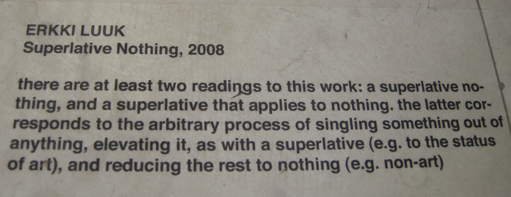
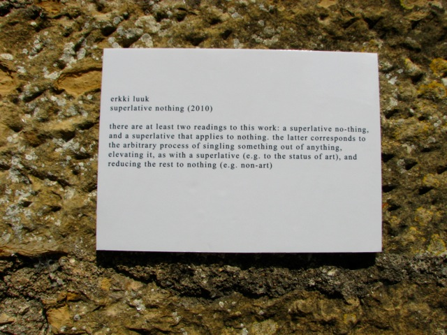
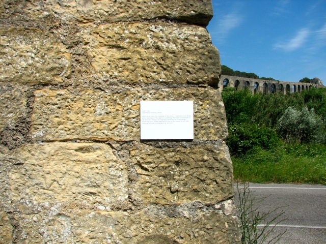

# Erkki Luuk

*Short introduction goes here (under 50 characters).*

---

## Isikunäitused (koos c:ga (Tanel Rander)):

— "uriaadi lõpp" (Y-galerii 2010)  
[uriaadi lõpp](http://chnldr.blogspot.com/2010/12/erkki-luuk-c-uriaadi-lopp-keldres-v.html)

— "kesktalvine hnott" (Tallinna Linnagalerii 2010)  
[kesktalvine hnott](http://chnldr.blogspot.com/2010/12/c-erkki-luuk-kesktalvine-hnott-on.html)

---

### Project Title 1

Description of the project. Include a link such as  
[https://example.com](https://example.com)

**Participating artist(s):** Name(s)  
**Materials:** List materials  
**Year:** 20XX

---

## Project Title 2

Short description with a link:  
[https://example.com](https://example.com)

**Participating artist(s):** Name(s)  
**Materials:** List materials  
**Year:** 20XX

---

## Project Title 3

*Optional video embed (GitHub Pages supports raw HTML):*

<video controls width="400">
  <source src="path-to-video.mp4" type="video/mp4">
</video>

Description with link:  
[https://example.com](https://example.com)

**Participating artist(s):** Name(s)  
**Materials:** List materials  
**Year:** 20XX

---

## Project Title 4

Description with link:  
[https://example.com](https://example.com)

**Participating artist(s):** Name(s)  
**Materials:** List materials  
**Year:** 20XX

---

## Rahvusvaheline konverents, teaduslik konverents

Description with link:  
[https://example.com](https://example.com)

**Participating artist(s):** Name(s)  
**Materials:** List materials  
**Year:** 2009‒2015

---

## Superlative nothing

Conceptual text art

**Materials:** Text, badge  
**Year:** 2008 (Celje, Slovenia), 2010 (remake; Tomar, Portugal)

---
